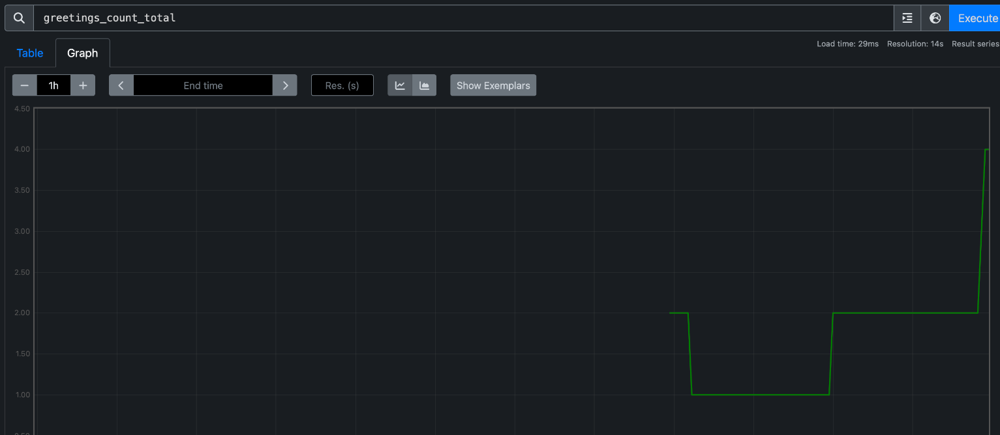

# Relatório sobre Implementação de Métricas com OpenTelemetry, Prometheus, Jaeger e Grafana

## Tecnologias Utilizadas

### OpenTelemetry
OpenTelemetry é uma iniciativa de código aberto para coleta de dados de telemetria, como métricas, rastreamentos e logs. Facilita a observação de sistemas distribuídos através de uma API unificada e ferramentas para diferentes linguagens de programação.

### Prometheus
Prometheus é uma solução de monitoramento e alerta que coleta e processa métricas em um modelo de dados multidimensional, com suporte para consultas em tempo real.

### Jaeger
Jaeger oferece rastreamento distribuído, permitindo monitorar e analisar interações em sistemas complexos, facilitando a identificação de problemas e gargalos de desempenho.

### Grafana
Grafana é uma plataforma para visualização e análise de dados, que permite criar painéis dinâmicos para explorar métricas e logs de diversas fontes, como Prometheus e Jaeger.

## Conceitos Aprendidos

- **Instrumentação de Código**: Prática de incorporar código para coletar dados de telemetria, utilizando a API do OpenTelemetry.
- **Exportação de Dados**: Entendimento do processo de envio de dados de telemetria para sistemas como Prometheus e Jaeger.
- **Visualização de Dados**: Uso do Grafana para criar visualizações que ajudam na análise de desempenho e na solução de problemas.

## Problemas Encontrados

- **Duplicação de Referências de Pacotes**: Alertas de duplicidade em referências de pacotes que podem afetar a execução do código.
- **Erros de Compilação**: Complicações devido a referências ausentes, necessitando uma verificação e ajuste nas dependências.
- **Configuração de Exportadores e Instrumentações**: Desafios na configuração dos sistemas para garantir a correta exportação e coleta de dados.

## Resumo

Este relatório discute a experiência com a implementação de métricas utilizando OpenTelemetry, Prometheus, Jaeger e Grafana. Os desafios encontrados reforçam a necessidade de uma configuração cuidadosa e compreensão das tecnologias para uma observabilidade efetiva de sistemas distribuídos.

